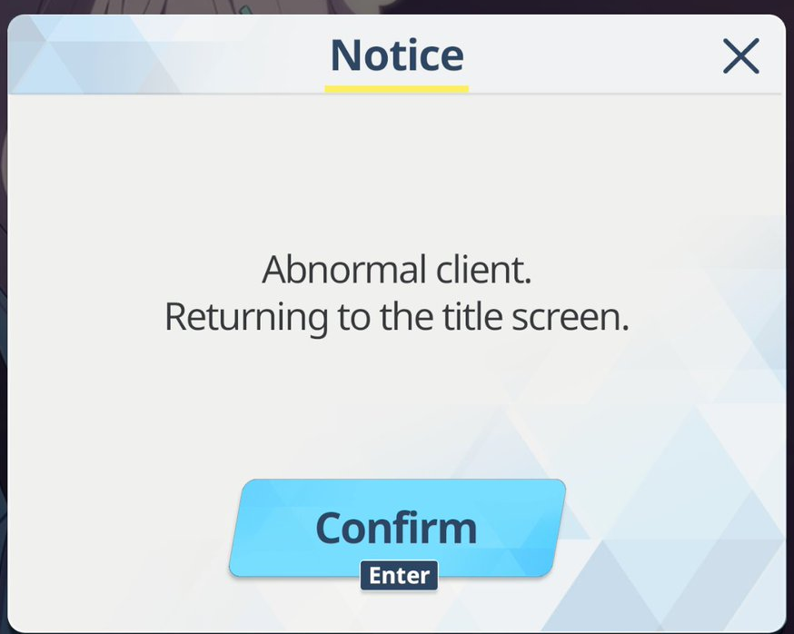
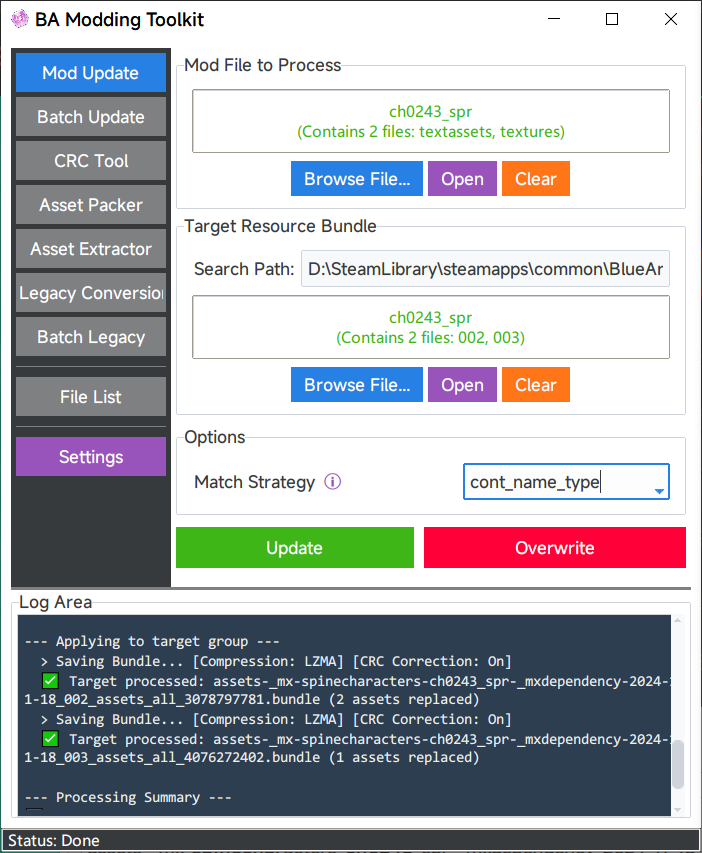

<div align="center" style="text-align:center">
  <p>
    
  </p>
  <p>
    
    
    
    
  </p>
</div>

# BA Modding Toolkit

> [!NOTE]
> English Translations are available now. If you find any errors or have any suggestions, please feel free to submit an issue or pull request.

[简体中文](README_zh-CN.md) | English

A toolkit based on UnityPy for automating the creation and updating of Blue Archive/ブルーアーカイブ mods.

Supports Steam version (PC) and other versions (Global/JP server, PC/Android/iOS).

## Introduction



- Downloaded a mod from the internet, replaced the corresponding file in the game directory, but the game shows "Abnormal Client" and cannot login?
- Downloaded a mod released a long time ago, but the filename is different from the latest version? Even after replacement, the character image doesn't change/doesn't display at all/game freezes?
- Want to create your own mod to replace character illustrations, but don't know how to operate?
- Want to extract character illustrations or other assets?

BA Modding Toolkit can help you solve the above problems, with foolproof operations, no need to manually manipulate bundle files.

## Getting Started

You can download the latest version of the executable file from the [Releases](https://github.com/Agent-0808/BA-Modding-Toolkit/releases) page, and double-click to run the program.

## Program Functionalities

> [!TIP]
> Check out the [Usage](https://github.com/Agent-0808/BA-Modding-Toolkit/wiki/Usage) Page for detailed instructions.

The program contains multiple functionalities:

- **Mod Update**: Update or port Mod files between different platforms
- **Batch Update**: Batch process multiple Mod files
- **CRC Tool**: CRC checksum calculation and correction functionality
- **Asset Packer**: Pack asset files from a folder into a Bundle file, replacing the corresponding assets in the Bundle
- **Asset Extractor**: Extract specified types of assets from Bundle files
- **Legacy Conversion**: Convert between Legacy format(old global version) and Modern format(JP and new global version)
- **Batch Legacy**: Batch convert Legacy format to Modern format
- **ADB File Push**: Push local files to Android devices using ADB commands.
- **File List**: View and manage all Bundle files in the specified directory.



## Add-Ons

The add-ons mentioned in this section are optional, and you can choose whether to enable them according to your needs.

> [!WARNING]
> The following add-ons are independent third-party programs. Please comply with their licenses when downloading and using them.
> 
> BA-Modding-Toolkit only invokes the programs through `subprocess` module. It does not contain or distribute any code or files of these programs, nor is it responsible for any issues that may arise during their use.

### Spine Skeleton Data Converter

**[wang606/SpineSkeletonDataConverter](https://github.com/wang606/SpineSkeletonDataConverter)**

This tool can convert Spine 3 format `.skel` files used in some older Mods to the Spine 4 format supported by the current game version. 
Additionally, it can convert Spine 4 format files to Spine 3 format in the "Asset Extractor" feature.

Configure the path of the `SpineSkeletonDataConverter.exe` program in the settings interface and check the "Enable Spine Conversion" option.

- There may be inconsistencies before and after conversion.
- Even if `SpineSkeletonDataConverter.exe` is not configured, you can still use this program normally to update Mods that *use Spine files compatible with the current version (4.2.xx)*.
- If the Mod you want to update was made in 2025 or later, it already uses the Spine 4 format, so you can update it normally without configuring this option.

### Spine Viewer

**[ww-rm/SpineViewer](https://github.com/ww-rm/SpineViewer)**

This tool can preview and render Spine skeleton animation files. You can configure the path of the `SpineViewerCLI.exe` program in the settings interface and preview the Spine animation in the "File List" window.

### ADB (Android Debug Bridge)

**[Android Debug Bridge](https://developer.android.com/tools/releases/platform-tools)**

This tool can communicate with Android devices. You can configure the path of `adb.exe` in the settings interface to directly read and write files on Android devices in the same way as local files on Windows, without manually exporting or importing files from Android devices.

- This feature requires an Android device to be connected and authorized for this program to access.
- After setting the path to `adb.exe`, select the target Android device and corresponding file source in the "Settings" window.

### BA-characters-internal-id

**[Agent-0808/BA-characters-internal-id](https://github.com/Agent-0808/BA-characters-internal-id)**

A reference table that records the mapping between in-game character names and their corresponding internal file IDs (e.g., `CH0288` → Utsumi Aoba).

- In the "File List" window, after parsing the internal ID from a Bundle file name, the actual character name can be displayed according to this reference table.
- Support in more features is planned for future updates.

## Command Line Interface (CLI)

In addition to the graphical interface, this project provides a Command Line Interface (CLI) version `cli/main.py`.

You can download the precompiled executable file `BAMT-CLI.exe` from the [Releases](https://github.com/Agent-0808/BA-Modding-Toolkit/releases) page or use the `uv run bamt-cli` command to run the source code.

### CLI Usage

All operations can be executed via the `bamt-cli` command. You can use `--help` to view all available commands and parameters.

```bash
# View all available commands
bamt-cli -h

# View detailed help and examples for a specific command
bamt-cli update -h
bamt-cli batch-update -h
bamt-cli merge -h
bamt-cli split -h
bamt-cli batch-legacy -h
bamt-cli pack -h
bamt-cli extract -h
bamt-cli crc -h

# View environment information
bamt-cli env
```

> [!NOTE]
> Due to the technical limitation of the `Tap` library, the compiled binary file cannot display parameter variable annotations. When running the source code, the parameter variable annotations will be displayed in the help information.

Check the [CLI Usage](https://github.com/Agent-0808/BA-Modding-Toolkit/wiki/CLI-Usage-&-Arguments) Page for Complete Usage Instructions.

## Technical Details

### Tested Environments

The table below lists tested environment configurations for reference.

| Operating System | Python | UnityPy | Pillow | Status | Note   |
|:------------------- |:-------------- |:--------------- |:-------------- |:------ | :--- |
| Windows 10          | 3.12.4         | 1.23.0     | 12.0.0    | ✅   | Dev Env |
| Windows 10          | 3.11.x         | 1.23.0     | 12.0.0    | ✅   |  |
| Windows 10          | 3.12.4         | 1.23.0     | 10.4.0    | ✅   |  |
| Windows 10          | 3.13.7         | 1.23.0     | 11.3.0    | ✅   |  |
| Windows 10          | 3.12.4         | 1.24.0     | 10.4.0    | ❌   |  |
| Ubuntu 22.04 (WSL2) | 3.13.10        | 1.23.0     | 12.0.0    | ✅   |  |

## Developing

Please ensure that Python 3.11 or higher is installed.

```bash
git clone https://github.com/Agent-0808/BA-Modding-Toolkit.git
cd BA-Modding-Toolkit

# use uv to manage dependencies
python -m pip install uv
uv sync
uv run bamt
# or use legacy way to install dependencies
python -m pip install .
python -m ba_modding_toolkit
```

The author's programming skills are limited, welcome to provide suggestions or issues, and also welcome to contribute code to improve this project.

You can add `BA-Modding-Toolkit` code to your project or modify the existing code to implement custom Mod creation and update functionality.

`cli/main.py` is a command-line interface (CLI) version of the main program, which you can refer to for calling processing functions.

### File Structure

```
BA-Modding-Toolkit/
│ 
│ # ============= Code =============
│ 
├── src/ba_modding_toolkit/
│ ├── __init__.py
│ ├── __main__.py    # Entry point
│ ├── core.py        # Core processing logic
│ ├── searching.py   # Searching logic
│ ├── bundle.py      # Bundle class
│ ├── naming.py      # File naming logic
│ ├── models.py      # Data models
│ ├── i18n.py        # Internationalization functionality
│ ├── utils.py       # Utility classes and helper functions
│ ├── adb/           # ADB related modules
│ ├── cli/           # Command Line Interface (CLI) package
│ │ ├── __main__.py     # CLI Entry Point
│ │ ├── main.py         # CLI Main Program
│ │ ├── taps.py         # Command Line Argument Parsing
│ │ └── handlers.py     # Command Line Argument Handling
│ ├── gui/           # GUI package
│ │ ├── __init__.py
│ │ ├── main.py         # GUI program main entry point
│ │ ├── app.py          # Main application App class
│ │ ├── base_tab.py     # TabFrame base class
│ │ ├── components.py   # UI components, themes, logging
│ │ ├── configs.py      # Configuration definitions
│ │ ├── utils.py        # UI related utility functions
│ │ ├── windows/        # Individual windows
│ │ │ ├── __init__.py
│ │ │ ├── adb_browser.py        # ADB Browser window
│ │ │ ├── dialogs.py            # Settings dialogs 
│ │ │ └── file_list_window.py   # File List window
│ │ └── tabs/           # Feature tabs
│ │   ├── __init__.py
│ │   ├── mod_update_tab.py        # Mod Update tab
│ │   ├── batch_update_tab.py      # Batch Update tab
│ │   ├── crc_tool_tab.py          # CRC Tool tab
│ │   ├── asset_packer_tab.py      # Asset Packer tab
│ │   ├── asset_extractor_tab.py   # Asset Extractor tab
│ │   ├── legacy_conversion_tab.py # Legacy Conversion tab
│ │   └── batch_legacy_tab.py      # Batch Legacy tab
│ ├── assets/         # Project assets
│ └── locales/        # Language files
├── tests/            # Pytest test cases folder
│ ├── assets/         # Test assets
│ └── test_*.py       # Test cases
├── config.toml       # Local configuration file (automatically generated)
│ 
│ # ============= Misc. =============
│ 
├── requirements.txt # Python dependency list (for legacy installation)
├── pyproject.toml   # Python project configuration file
├── LICENSE          # Project license file
├── docs/            # Project documentation folder
│ └── help/              # Images in help documentation
├── README_zh-CN.md  # Project documentation (Chinese)
└── README.md        # Project documentation (this file)
```

## Acknowledgement

Thank you to all contributors for their valuable contributions.

Special thanks to:

- [Deathemonic](https://github.com/Deathemonic): Patching CRC with [BA-CY](https://github.com/Deathemonic/BA-CY).
- [kalina](https://github.com/kalinaowo): Creating the prototype of the `CRCUtils` class.

### Third-Party Libraries

This project uses the following excellent 3rd-party libraries:

- [UnityPy](https://github.com/K0lb3/UnityPy) (MIT License): Core library for parsing and manipulating Unity Bundle files
- [Pillow](https://python-pillow.github.io/) (MIT License): Image processing
- [tkinterdnd2](https://github.com/pmgagne/tkinterdnd2) (MIT License): Adds drag-and-drop functionality support for Tkinter
- [ttkbootstrap](https://github.com/israel-dryer/ttkbootstrap) (MIT License): Modern Tkinter theme library
- [toml](https://github.com/uiri/toml) (MIT License): Parse and dump TOML configuration file
- [SpineAtlas](https://github.com/Rin-Wood/SpineAtlas) (MIT License): Spine animation file atlas parser and editor
- [Tap](https://github.com/swansonk14/typed-argument-parser) (MIT License): Parsing command line arguments
- [pytest](https://pytest.org/en/stable/) (MIT License): Test framework

### See Also

Some useful related repositories:

- [BA-AD](https://github.com/Deathemonic/BA-AD)：Download original game resources
- [AtlasToolkit](https://github.com/com55/AtlasToolkit): Extract, modify, and repack atlas sprites

### Disclaimer

<sub>
BA Modding Toolkit is a personal project and is not affiliated with, endorsed by, or connected to NEXON Games Co., Ltd., NEXON Korea Corp., Yostar, Inc., or any of their subsidiaries. All game assets, characters, music, and related intellectual property are the trademarks or registered trademarks of their respective owners. They are used in this tool for educational and interoperability purposes only (fair use). Please respect the Terms of Service of the official game. Do not use this tool for cheating or malicious activities.
</sub>
