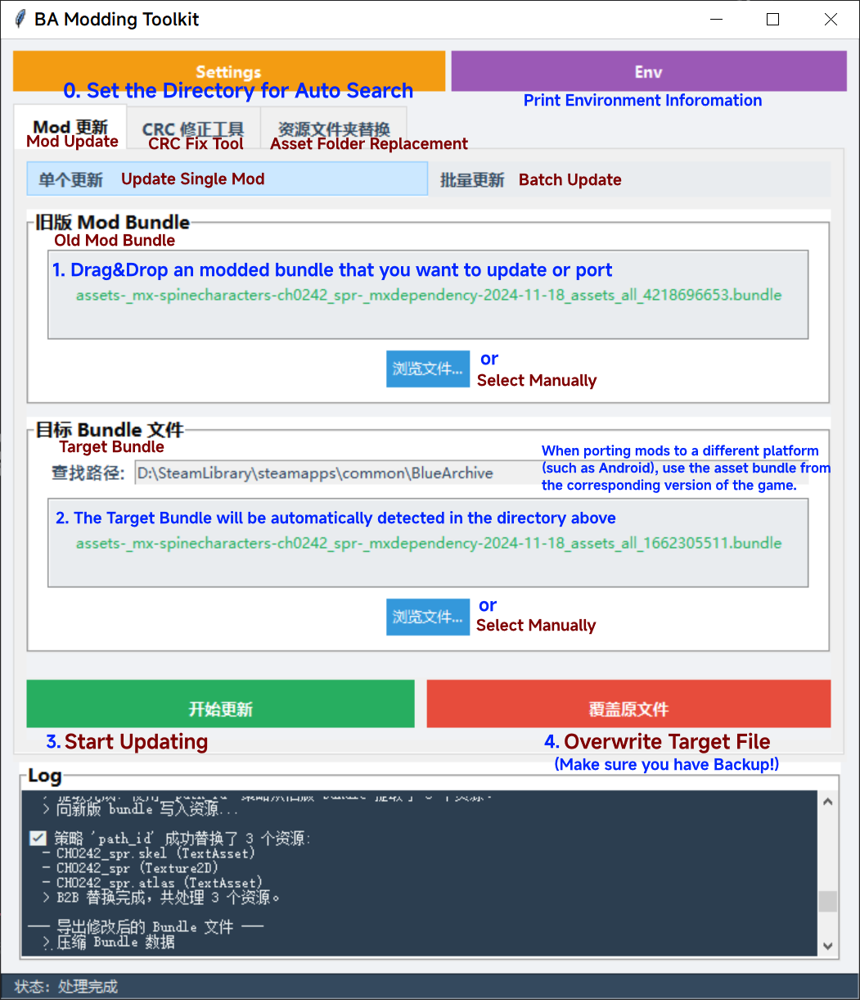

<div align="center" style="text-align:center">
  <p>
    
  </p>
  <p>
    
    
    
    
  </p>
</div>

# BA Modding Toolkit

> Note: i18n support is currently being added. As a temporary transition solution, non-Chinese users will use "debug" language by default when launching the program, which will display localization keys. This should largely help English users use the program.

[简体中文](README_zh-CN.md) | English

A toolkit based on UnityPy for automating the creation and updating of Blue Archive/ブルーアーカイブ mods.

Supports Steam version (PC) and mobile versions (Global/JP server, Android/iOS).

## Introduction


- Downloaded a mod from the internet, replaced the corresponding file in the game directory, but the game shows "Abnormal Client" and cannot login?
- Downloaded a mod released a long time ago, but the filename is different from the latest version? Even after replacement, the character image doesn't change/doesn't display at all/game freezes?
- Want to create your own mod to replace character illustrations, but don't have Unity knowledge?
- Want to unpack game resources and extract character illustrations or other assets?

BA Modding Toolkit can help you solve the above problems, with completely foolproof operations, no need to manually manipulate bundle files.

## Getting Started

You can download the latest version of the executable file from the [Releases](https://github.com/Agent-0808/BA-Modding-Toolkit/releases) page, and double-click to run the program.

## Program Functionalities

The program contains multiple functional tabs:
- **Mod 更新** (Mod Update): Update or port Mod files between different platforms
    - **单个更新** (Single Update): Update a single Mod file
    - **批量更新** (Batch Update): Batch process multiple Mod files
- **CRC 修正工具** (CRC Fix Tool): CRC checksum correction functionality
- **资源打包** (Asset Packer): Pack asset files from a folder into a Bundle file, replacing the corresponding assets in the Bundle
- **资源提取** (Asset Extractor): Extract specified types of assets from Bundle files
- **JP/GB转换** (JP/GB Conversion): Convert between JP server format and Global server format


## How to Use

### Settings
- Click the **Settings** button at the top of the main interface to open the settings window, configure the game root directory and output directory.
- Click the "Save" button to save the configuration, which will be automatically restored upon next startup.

<details>
<summary>Click to expand detailed settings interface description</summary>


#### Directory Settings
- **游戏根目录** (Game Root Directory): Set the game installation directory.
    - The program can automatically detect the following subdirectories:
    ```
    "BlueArchive_Data/StreamingAssetsPUB/Resource/GameData/Windows",
    "BlueArchive_Data/StreamingAssetsPUB/Resource/Preload/Windows",
    "GameData/Windows",
    "Preload/Windows",
    "GameData/Android",
    "Preload/Android",
    ```
- **输出目录** (Output Directory): Set the save location for generated files

#### Global Options
- **CRC 修正** (CRC Fix): Automatically corrects the Bundle file's CRC checksum, preventing the file from being rejected after modification
    - Currently only required for Steam version Mods, can be ignored for other versions
- 添加私货: Add `0x08080808` before CRC correction. ~~You can ignore it lol~~
- **创建备份** (Create Backup): Creates a backup of the original file before overwriting it
- **压缩方式** (Compression Method): Select the compression method for Bundle files (LZMA, LZ4, Keep Original, No Compression)

#### Asset Type Options
- **Texture2D**: Illustrations, textures, image assets
- **TextAsset**: `.atlas`, `.skel` files, Spine animation skeleton files
- **Mesh**: 3D model assets
- **ALL**: All types of assets, including those not listed above (experimental, not recommended)

#### Spine Converter (Experimental Feature)
(Optional) Uses a third-party program to convert Spine 3.8 format `.skel` files from some old mods to the currently supported 4.2 format.
- You need to download the third-party Spine converter program yourself. BAMT only calls the program to convert Spine files, not provides the program itself.
- Download URL: [SpineSkeletonDataConverter](https://github.com/wang606/SpineSkeletonDataConverter/releases)
- Configure the path to `SpineSkeletonDataConverter.exe` in the settings interface, and check the "启用 Spine 转换" (Enable Spine Conversion) option.
- Configure the path to `SpineAtlasDowngrade.exe` in the settings interface, and check the "Spine降级" (Spine Downgrade) option. If enabled, the program will convert the Spine Atlas file to Spine 3.8 format in the **Asset Extraction** process.

##### Notes
- This is an experimental feature that cannot guarantee all mods can be successfully upgraded, suitable only for advanced users.
- Even without configuring `SpineSkeletonDataConverter.exe`, you can still use this program normally to update mods that *use Spine files compatible with the current version (4.2.xx)*.
    - If the mod you want to update was created in 2025 or later, it already uses Spine 4.2 format and can be updated normally without configuring this option.
- The `SpineAtlasDowngrade.exe` program is used during **asset extraction** to convert `.atlas` files to Spine 3.8 format, making it easier for mod creators to edit.
    - If you only need to update mods, you don't need to configure this option.

</details>


> Note: i18n support is still in development, these are temporary UI texts.

### Mod 更新 (Mod Update)
#### 单个更新 (Single Update)
1. Drag and drop or browse to select the old Mod Bundle file that needs to be updated
2. The program will automatically find the corresponding target Bundle file in the resource directory
3. Check the asset types that need to be replaced in the settings window
4. Click the "开始更新" (Start Updating) button, the program will automatically process and generate the updated Bundle file
5. (Optional) After success, click "覆盖原文件" (Overwrite Original File) to apply the modifications. Please ensure the "创建备份" (Create Backup) option is enabled to prevent risks.

This feature can also be used to port mods between different platforms, just select the Bundle file from the corresponding platform in step 2.

#### 批量更新 (Batch Update)
1. Drag and drop or browse to select a folder containing multiple Mod files, or directly drag and drop multiple Mod files
    - The 4 buttons below are: 添加文件 (Add a File), 添加文件夹 (Add a Folder), 移除选中 (Remove Selected), 清空列表 (Clear List).
2. The program will automatically identify and list all processable Mod files
3. Configure asset types and other options in the settings window
4. Click the "开始批量更新" (Start Batch Update) button, the program will process all selected Mod files in sequence

### CRC 修正工具 (CRC Fix Tool)
1. Drag and drop or browse to select the target Bundle file that needs to be modified
2. The program will automatically find the corresponding original Bundle file in the resource directory
3. Click the "运行 CRC 修正" (Run CRC Fix) button: automatically corrects the Bundle file's CRC checksum
4. (Optional) After success, click "替换原始文件" (Replace Original File) to apply the modifications. Please ensure the "创建备份" (Create Backup) option is enabled to prevent risks.

The "计算CRC值" (Calculate CRC Value) button can be used to manually view the CRC checksum of a single file or two files.

### 资源提取 (Asset Extractor)
1. Drag and drop or browse to select the Bundle file to extract assets from
2. Select an output directory, the program will automatically create a subdirectory named after the Bundle file
3. (Optional) In the settings window, configure `SpineAtlasDowngrade.exe` program path, and enable "启用 Spine 降级" (Enable Spine Downgrade) option. If enabled, the program will automatically call the third-party program to convert the Spine files to Spine 3.8 format in the extraction process.
4. Click the "开始提取" (Start Extraction) button, the program will extract the specified types of assets

This feature is for extracting assets from existing Bundle files for modification or preview.

Supported asset types: `Texture2D` (`.png`), `TextAsset`(`.skel`、`.atlas`)

### 资源打包工具 (Asset Packer)
1. Drag and drop or browse to select the folder containing assets to be packed
    - Supported file types: `.png` (textures), `.skel`, `.atlas` (Spine animation files)
    - Ensure asset filenames match the asset names in the target Bundle file
2. Drag and drop or browse to select the target Bundle file that needs to be modified
3. Click the "开始打包" (Start Packing) button: performs the asset packing operation
4. (Optional) After success, click "覆盖原文件" (Overwrite Original File) to apply the modifications. Please ensure the "创建备份" (Create Backup) option is enabled to prevent risks.

This feature is for creating new Mods, such as quickly packaging modified assets into Bundle files.

#### Example
Assume you are creating a mod for character `CH0808`, and you have extracted the related illustration assets to a `texture` folder using the "Asset Extractor" feature. This directory should contain the following files:
- CH0808_spr.png
- CH0808_spr.atlas
- CH0808_spr.skel

After modifying these files, you can package them into a Bundle file using the "Asset Packer" feature.

Drag the `texture` folder to the first input box of the interface, and drag the corresponding Bundle file (e.g., `*-spinecharacters-ch0808_spr-*.bundle`) to the second input box of the program, then click the "开始打包" (Start Packing) button to generate a new Bundle file.

This will replace the assets with the same name in the target Bundle with the `*.png`, `*.skel`, and `*.atlas` files from the `texture` folder.

### JP/GB转换 (JP/GB Conversion)
Conversion between JP server format (two separate Bundle files) and Global server format (one Bundle file) for a mod that modified the Spine assets.

1. Select the conversion direction at the top of the page (JP -> Global or Global -> JP)
2. Select the Global server Bundle file (as the base file or source file depending on the conversion direction)
3. Select the JP server Bundle file list (supports multiple files, can be dragged and dropped or browsed to select)
   - You can manually select multiple JP server Bundle files
   - If you have configured the game root directory in the settings and enabled "Auto Search", the matching JP files will be automatically found after selecting the Global server file
4. Click the "开始转换" (Start Conversion) button
   - JP -> Global: The program will extract assets from the list of JP server Bundle files and merge them into the Global server version file
   - Global -> JP: The program will split the Global server format Bundle into the list of JP server Bundle files

## Command Line Interface (CLI)

In addition to the graphical interface, this project provides a Command Line Interface (CLI) version `maincli.py`.

The current GUI does not support internationalization (the interface is in Chinese only), but the CLI version's help information and parameter descriptions are in English. If you prefer an English interface or need to use it in a non-GUI environment, the CLI version is an excellent choice.

### CLI Usage

All operations can be executed via the `python maincli.py` command. You can use `--help` to view all available commands and parameters.

```bash
# View all available commands
python maincli.py -h

# View detailed help and examples for a specific command
python maincli.py update -h
python maincli.py pack -h
python maincli.py crc -h

# View environment information
python maincli.py env
```

<details>
<summary>Click to expand detailed CLI instructions</summary>

#### Update Mod (update)

Used to update or port Mods, migrating assets from an old Mod to new game files. This is the core function.

**Main Arguments:**
- `--old`: (Required) Path to the old Mod file.
- `--resource-dir`: Game resource directory. The program will automatically search for matching new version files in this directory.
- `--target`: Manually specify the path to the new game file. If `--resource-dir` is also provided, this option takes precedence.
- `--output-dir`: (Optional) Output directory for generated files (default: `./output/`).
- `--enable-spine-conversion`: (Optional) Enable Spine skeleton conversion for upgrading old Mods.
- `--spine-converter-path`: (Optional) Full path to `SpineSkeletonDataConverter.exe`.

**Examples:**
```bash
# Example 1: Automatic search and update
python maincli.py update --old "path/to/old_mod.bundle" --resource-dir "path/to/GameData/Windows"

# Example 2: Manually specify target file for update
python maincli.py update --old "old_mod.bundle" --target "new_game_file.bundle" --output-dir "./updated_mods"
```

#### Asset Packer (pack)

Pack assets (e.g., `.png`, `.skel`, `.atlas`) from a folder into a specified Bundle file, replacing assets with the same name.

**Main Arguments:**
- `--bundle`: (Required) Path to the target Bundle file to be modified.
- `--folder`: (Required) Path to the folder containing new assets.
- `--output-dir`: Output directory for generated files (default: `./output/`).

**Examples:**
```bash
# Pack all assets from asset_folder into target_game_file.bundle
python maincli.py pack --bundle "target_game_file.bundle" --folder "./asset_folder" --output-dir "./packed_mods"
```

#### CRC Fix (crc)

Correct the CRC checksum for modified Bundle files to match the original files.

**Main Arguments:**
- `--modified`: (Required) Path to the modified Mod file.
- `--resource-dir`: Game resource directory, used to automatically find the corresponding original file.
- `--original`: Manually specify the original file path to extract the correct CRC value.
- `--check-only`: (Optional) Only check and compare CRC values without performing any modifications.

**Examples:**
```bash
# Example 1: Automatically find original file and fix CRC
python maincli.py crc --modified "my_mod.bundle" --resource-dir "path/to/GameData/Windows"

# Example 2: Manually specify original file for fix
python maincli.py crc --modified "my_mod.bundle" --original "original.bundle"

# Example 3: Only check CRC values, do not modify file
# Compare CRC of two files
python maincli.py crc --modified "my_mod.bundle" --original "original.bundle" --check-only
# Check CRC of a single file
python maincli.py crc --modified "my_mod.bundle" --check-only
```

</details>

## Technical Details

### Tested Environments

The table below lists tested environment configurations for reference.

| Operating System | Python Version | UnityPy Version | Pillow Version | Status | Note   |
|:------------------- |:-------------- |:--------------- |:-------------- |:------ | :--- |
| Windows 10          | 3.12.4         | 1.23.0          | 10.4.0         | ✅     | Dev Env |
| Windows 10          | 3.13.7         | 1.23.0          | 11.3.0         | ✅     |  |
| Ubuntu 22.04 (WSL2) | 3.13.10        | 1.23.0          | 12.0.0         | ✅     |  |

## Developing

Please ensure that Python 3.12 or higher is installed.

```bash
git clone https://github.com/Agent-0808/BA-Modding-Toolkit.git
cd BA-Modding-Toolkit

python -m pip install -r requirements.txt
python main.pyw
# or use uv to manage dependencies
uv sync
uv run main.pyw
```

The author's programming skills are limited, welcome to provide suggestions or issues, and also welcome to contribute code to improve this project.

You can add `BA-Modding-Toolkit` code (mainly `processing.py` and `utils.py`) to your project or modify the existing code to implement custom Mod creation and update functionality.

`maincli.py` is a command-line interface (CLI) version of the main program, which you can refer to for calling processing functions.

### File Structure

```
BA-Modding-Toolkit/
│ 
│ # ============= Code =============
│ 
├── main.pyw    # GUI program main entry point
├── ui/         # GUI package
│ ├── app.py        # Main application App class
│ ├── base_tab.py   # TabFrame base class
│ ├── components.py # UI components, themes, logging
│ ├── dialogs.py    # Settings dialogs
│ ├── utils.py      # UI related utility functions
│ └── tabs/         # Feature tabs
│   ├── mod_update_tab.py       # Mod Update tab
│   ├── crc_tool_tab.py         # CRC Fix Tool tab
│   ├── asset_packer_tab.py     # Asset Packer tab
│   ├── asset_extractor_tab.py  # Asset Extractor tab
│   └── jp_gb_conversion_tab.py # JP/GB Conversion tab
├── maincli.py       # Command-line interface entry point
├── processing.py    # Core processing logic
├── utils.py         # Utility classes and helper functions
├── i18n.py          # Internationalization functionality
├── locales/         # Language files
├── config.toml      # Local configuration file (automatically generated)
│ 
│ # ============= Misc. =============
│ 
├── requirements.txt # Python dependency list
├── pyproject.toml   # Python项目配置文件
├── LICENSE          # Project license file
├── assets/          # Project asset folder
│ └── help/              # Images in help documentation
├── README_zh-CN.md  # Project documentation (Chinese)
└── README.md        # Project documentation (this file)
```

## Acknowledgement

- [Deathemonic](https://github.com/Deathemonic): Patching CRC with [BA-CY](https://github.com/Deathemonic/BA-CY).
- [kalina](https://github.com/kalinaowo): Creating the prototype of the `CRCUtils` class, the starting point of BAMT.
- [afiseleo](https://github.com/fiseleo): Helping with the CLI version.
- [com55](https://github.com/com55): Assisting with Github workflow.
- [wang606](https://github.com/wang606): Spine version conversion feature based on [SpineSkeletonDataConverter](https://github.com/wang606/SpineSkeletonDataConverter) project.
    - SpineSkeletonDataConverter is a standalone third-party program, please follow its License when downloading and using it. SpineSkeletonDataConverter is NOT distributed with or included in BA Modding Toolkit. 

### Third-Party Libraries
This project uses the following excellent 3rd-party libraries:

- [UnityPy](https://github.com/K0lb3/UnityPy): Core library for parsing and manipulating Unity Bundle files
- [Pillow](https://python-pillow.github.io/): Export functionality for Texture2D type assets in the game
- [tkinterdnd2](https://github.com/pmgagne/tkinterdnd2): Adds drag-and-drop functionality support for Tkinter
- [ttkbootstrap](https://github.com/israel-dryer/ttkbootstrap): Modern Tkinter theme library
- [toml](https://github.com/uiri/toml): TOML configuration file parser

## See Also
Some useful related repositories:
- [BA-characters-internal-id](https://github.com/Agent-0808/BA-characters-internal-id) ：Search for character names and internal file IDs
- [BA-AD](https://github.com/Deathemonic/BA-AD)：Download original game resources
- [SpineViewer](https://github.com/ww-rm/SpineViewer)：Preview Spine animation files