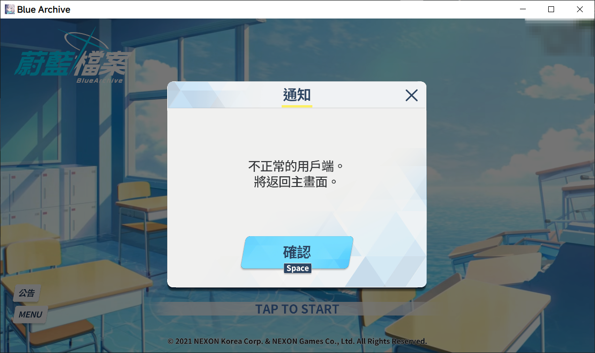
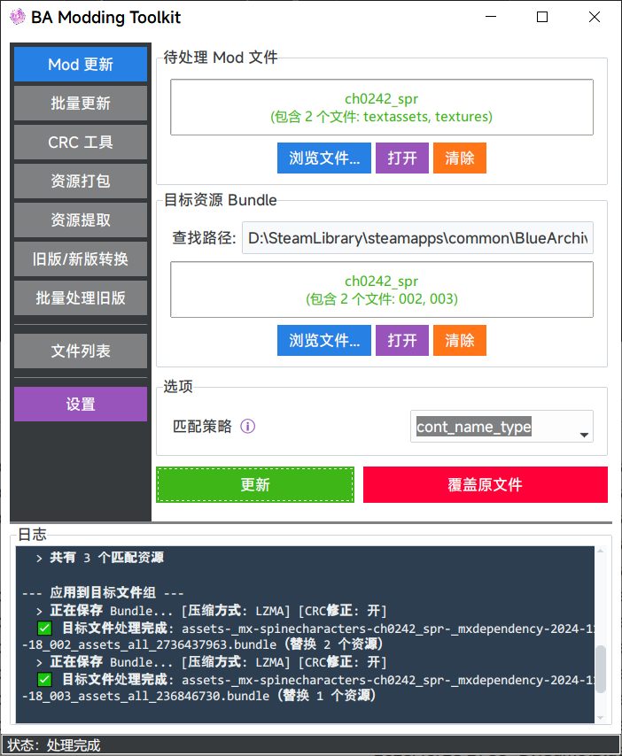

<div align="center" style="text-align:center">
  <p>
    
  </p>
  <p>
    
    
    
    
  </p>
</div>

# BA Modding Toolkit

简体中文 | [English](README.md)

一个基于 UnityPy 的工具集，可用于自动化制作与更新 Blue Archive（碧蓝档案/蔚蓝档案/ブルーアーカイブ）游戏的 Mod 文件流程。

支持Steam版（PC）与其他版本（国际服/日服，PC/Android/iOS）。

## 介绍



- 从网上下载的 mod，替换了游戏目录下的对应文件，进游戏却显示“不正常的用戶端”，无法登录？
- 从网上下载了发布于很久以前的 mod，但文件名与最新的不同？即使替换后进入游戏，对应的角色图像没有变化/完全不显示/游戏卡死？
- 想要自己制作一个 mod，替换角色立绘，但不懂如何操作？
- 想要提取角色立绘或其他资源？

BA Modding Toolkit 可以帮助您解决以上问题，完全傻瓜式操作，无需对bundle文件手动操作。

## 开始使用

您可以从页面右方的 [Releases](https://github.com/Agent-0808/BA-Modding-Toolkit/releases) 页面下载最新版本的可执行文件，直接双击运行即可启动程序。

## 程序功能说明

> [!TIP]
> 请查看 [使用方法](https://github.com/Agent-0808/BA-Modding-Toolkit/wiki/%E4%BD%BF%E7%94%A8%E6%96%B9%E6%B3%95) 页面参考详细用法说明。

程序包含多种功能：

- **Mod 更新**：用于更新或移植不同平台的 Mod
- **批量更新**：用于批量处理多个 Mod 文件
- **CRC 工具**：CRC 校验值计算与修正功能
- **资源打包**：将一个文件夹内的资源打包进对应的 Bundle ，替换 Bundle 中的同名资源
- **资源提取**：从 Bundle 文件中提取指定类型的资源到本地文件
- **旧版/新版转换**：旧版格式（国际服旧版）与新版格式（日服与国际服新版）的互相转换
- **批量处理旧版**：批量处理旧版→新版的转换任务
- **ADB 文件推送**：使用 ADB 命令将本地文件推送至 Android 设备上
- **文件列表**：用于查看和管理当前指定目录下的所有 Bundle 文件信息



## 扩展功能

本节中提到的扩展功能都是可选性质的，您可以根据需要选择是否启用。

> [!WARNING]
> 以下的扩展功能都是独立的第三方程序，当下载并使用时请遵守其协议。
> 
> BA-Modding-Toolkit 仅通过 `subprocess` 方式通过命令行调用对应程序，不会包含、分发这些程序的任何代码或文件，也不负责其使用过程中可能出现的任何问题。

### Spine 骨骼转换工具

**[wang606/SpineSkeletonDataConverter](https://github.com/wang606/SpineSkeletonDataConverter)**

该工具可以将一些较老的 Mod 中使用的 Spine 3 格式 `.skel` 文件转换为当前游戏版本支持的 Spine 4 格式。
此外，也可以在"资源提取"功能中，把提取的文件从 Spine 4 格式降级为 Spine 3 格式。

在设置界面配置 `SpineSkeletonDataConverter.exe` 程序的路径，并勾选"启用 Spine 转换"选项。

- 转换前后的展示效果可能并不完全一致。
- 即使不配置 `SpineSkeletonDataConverter.exe`，也可以正常使用本程序来更新*使用与当前版本（4.2.xx）兼容的Spine文件*的 Mod。
- 如果您想要更新的Mod制作于 2025 年及之后，则其已经使用了 Spine 4 格式，无需配置该选项也可正常更新。

### Spine 预览工具

**[ww-rm/SpineViewer](https://github.com/ww-rm/SpineViewer)**

该工具可以预览与渲染 Spine 的骨骼动画文件。您可以在设置界面配置 `SpineViewerCLI.exe` 程序的路径，并在“文件列表”窗口中右键预览指定的Bundle文件中的Spine动画。

### ADB(Android Debug Bridge)

**[Android Debug Bridge](https://developer.android.com/tools/releases/platform-tools)**

该工具可以与 Android 设备进行通信。您可以在设置界面配置 `adb.exe` 程序的路径，便可使用与 Windows 上本地文件一样的方式直接读取、写入 Android 设备上的文件，无需再手动导出、导入 Android 设备中的文件。

- 该功能需要您已连接 Android 设备，并且已授权该程序访问您的设备。
- 设置 `adb.exe` 程序的路径后，在“设置”窗口内选择目标 Android 设备与对应的文件来源即可。

### BA-characters-internal-id

**[Agent-0808/BA-characters-internal-id](https://github.com/Agent-0808/BA-characters-internal-id)**

一个对照表，记录了游戏中角色的名称与对应的文件内部ID的对照关系（例如：`CH0288` → 内海 青叶）。

- 在“文件列表”窗口中，解析Bundle文件的文件名获得内部ID之后，可以根据该对照表显示角色实际名称。
- 后续计划在更多功能中提供支持。

## 命令行接口 (CLI)

除了图形界面，本项目还提供了一个命令行接口（CLI）版本的程序 `cli/main.py`。

可以从 [Releases](https://github.com/Agent-0808/BA-Modding-Toolkit/releases) 页面下载经过编译的可执行文件`BAMT-CLI`，也可以使用`uv run bamt-cli`命令运行源代码。

### CLI 使用方法

所有操作都可以通过 `bamt-cli` 命令执行。您可以通过 `--help` 查看所有可用命令和参数。

```bash
# 查看所有可用命令
bamt-cli -h

# 查看特定命令的详细帮助和示例
bamt-cli update -h
bamt-cli batch-update -h
bamt-cli merge -h
bamt-cli split -h
bamt-cli batch-legacy -h
bamt-cli pack -h
bamt-cli extract -h
bamt-cli crc -h

# 查看环境信息
bamt-cli env
```

> [!NOTE]
> 由于`Tap`库技术限制，打包后的二进制文件无法显示参数变量的注释信息。当使用源代码运行时，参数变量的注释信息会显示在帮助信息中。

请查看 [CLI Usage](https://github.com/Agent-0808/BA-Modding-Toolkit/wiki/CLI-Usage-&-Arguments) 页面参考详细用法说明。

## 技术细节

### 经过测试的环境

下表列出了经过测试的环境配置，供参考。

| 操作系统 (OS)           | Python 版本 | UnityPy 版本 | Pillow 版本 | 状态  | 备注   |
|:------------------- |:--------- |:---------- |:--------- |:--- | ---- |
| Windows 10          | 3.12.4    | 1.23.0     | 12.0.0    | ✅   | 开发环境 |
| Windows 10          | 3.11.x    | 1.23.0     | 12.0.0    | ✅   |  |
| Windows 10          | 3.12.4    | 1.23.0     | 10.4.0    | ✅   |  |
| Windows 10          | 3.13.7    | 1.23.0     | 11.3.0    | ✅   |  |
| Windows 10          | 3.12.4    | 1.24.0     | 10.4.0    | ❌   |  |
| Ubuntu 22.04 (WSL2) | 3.13.10   | 1.23.0     | 12.0.0    | ✅   |  |

## 开发

请安装 Python 3.12+ 版本，安装依赖后运行：

```bash
git clone https://github.com/Agent-0808/BA-Modding-Toolkit.git
cd BA-Modding-Toolkit

# 使用 uv 管理依赖
python -m pip install uv
uv sync
uv run bamt
# 或者使用传统方式安装依赖
python -m pip install .
python -m ba_modding_toolkit
```

作者的编程水平有限，欢迎提出建议或是issue，也欢迎贡献代码以改进本项目。

您可以将 `BA-Modding-Toolkit` 的代码加入您的项目中或是进行修改，以实现自定义的 Mod 制作和更新功能。

`cli/main.py` 是一个命令行接口（CLI）版本的主程序，您可以参考其调用处理函数的方式。

### 文件结构

```
BA-Modding-Toolkit/
│ 
│ # ============= 程序 =============
│ 
├── src/ba_modding_toolkit/
│ ├── __init__.py
│ ├── __main__.py    # 程序入口
│ ├── core.py        # 核心处理逻辑
│ ├── searching.py   # 搜索功能逻辑
│ ├── bundle.py      # Bundle 类
│ ├── naming.py      # 文件名处理逻辑
│ ├── models.py      # 数据模型类
│ ├── i18n.py        # 国际化功能相关
│ ├── utils.py       # 工具类和辅助函数
│ ├── adb/           # ADB 相关模块
│ ├── cli/           # 命令行接口子程序
│ │ ├── __main__.py     # CLI 主入口
│ │ ├── main.py         # 命令行程序主流程
│ │ ├── taps.py         # 命令行参数解析
│ │ └── handlers.py     # 命令行参数处理
│ ├── gui/           # 图形界面包
│ │ ├── __init__.py
│ │ ├── main.py         # GUI 程序主入口
│ │ ├── app.py          # 主应用 App 类
│ │ ├── base_tab.py     # TabFrame 基类
│ │ ├── components.py   # UI 组件、主题、日志
│ │ ├── configs.py      # 配置项定义
│ │ ├── utils.py        # UI 相关工具函数
│ │ ├── windows/        # 独立窗口
│ │ │ ├── __init__.py
│ │ │ ├── adb_browser.py        # ADB 浏览器窗口
│ │ │ ├── dialogs.py            # 设置页 
│ │ │ └── file_list_window.py   # 文件列表窗口
│ │ └── tabs/           # 功能标签页
│ │   ├── __init__.py
│ │   ├── mod_update_tab.py        # Mod 更新标签页
│ │   ├── batch_update_tab.py      # 批量更新标签页
│ │   ├── crc_tool_tab.py          # CRC 工具标签页
│ │   ├── asset_packer_tab.py      # 资源打包标签页
│ │   ├── asset_extractor_tab.py   # 资源提取标签页
│ │   ├── legacy_conversion_tab.py # 旧版/新版格式转换标签页
│ │   └── batch_legacy_tab.py      # 批量旧版转新版标签页
│ ├── assets/         # 资源文件
│ └── locales/        # 语言文件
├── tests/            # Pytest 测试案例文件夹
│ ├── assets/         # 测试资源
│ └── test_*.py       # 测试案例文件
├── config.toml       # 本地配置文件（自动生成）
│ 
│ # ============= 杂项 =============
│ 
├── requirements.txt # Python 依赖列表（供传统方式安装使用）
├── pyproject.toml   # Python 项目配置文件
├── LICENSE          # 项目许可证文件
├── docs/            # 项目文档文件夹
│ └── help/              # 帮助文档中的图片
├── README_zh-CN.md  # 项目说明文档（中文，本文件）
└── README.md        # 项目说明文档
```

## 鸣谢

感谢所有为本项目提交代码与做出贡献的用户

特别鸣谢：

- [Deathemonic](https://github.com/Deathemonic): 基于 [BA-CY](https://github.com/Deathemonic/BA-CY) 项目实现 CRC 修正功能。
- [kalina](https://github.com/kalinaowo): 创建了 `CRCUtils` 类的原型。

### 第三方库

本项目使用了以下优秀的第三方库：

- [UnityPy](https://github.com/K0lb3/UnityPy)（MIT License）: 用于解析和操作 Unity Bundle 文件的核心库
- [Pillow](https://python-pillow.github.io/)（MIT License）: 图像处理库
- [tkinterdnd2](https://github.com/pmgagne/tkinterdnd2)（MIT License）: 为 Tkinter 添加拖放功能支持
- [ttkbootstrap](https://github.com/israel-dryer/ttkbootstrap)（MIT License）: 现代化的 Tkinter 主题库
- [toml](https://github.com/uiri/toml)（MIT License）: 用于解析和操作 TOML 配置文件的库
- [SpineAtlas](https://github.com/Rin-Wood/SpineAtlas)（MIT License）: 用于操作 Spine 动画文件中的 .atlas 文件
- [Tap](https://github.com/swansonk14/typed-argument-parser)（MIT License）: 解析命令行参数
- [pytest](https://pytest.org/)（MIT License）: 测试框架

### 另见

一些好用的相关仓库：

- [BA-AD](https://github.com/Deathemonic/BA-AD)：下载原版游戏资源
- [AtlasToolkit](https://github.com/com55/AtlasToolkit)：提取、修改、重新打包 .atlas 文件

### 免责声明 / Disclaimer

<sub>
BA Modding Toolkit is a personal project and is not affiliated with, endorsed by, or connected to NEXON Games Co., Ltd., NEXON Korea Corp., Yostar, Inc., or any of their subsidiaries. All game assets, characters, music, and related intellectual property are the trademarks or registered trademarks of their respective owners. They are used in this tool for educational and interoperability purposes only (fair use). Please respect the Terms of Service of the official game. Do not use this tool for cheating or malicious activities.
</sub>
